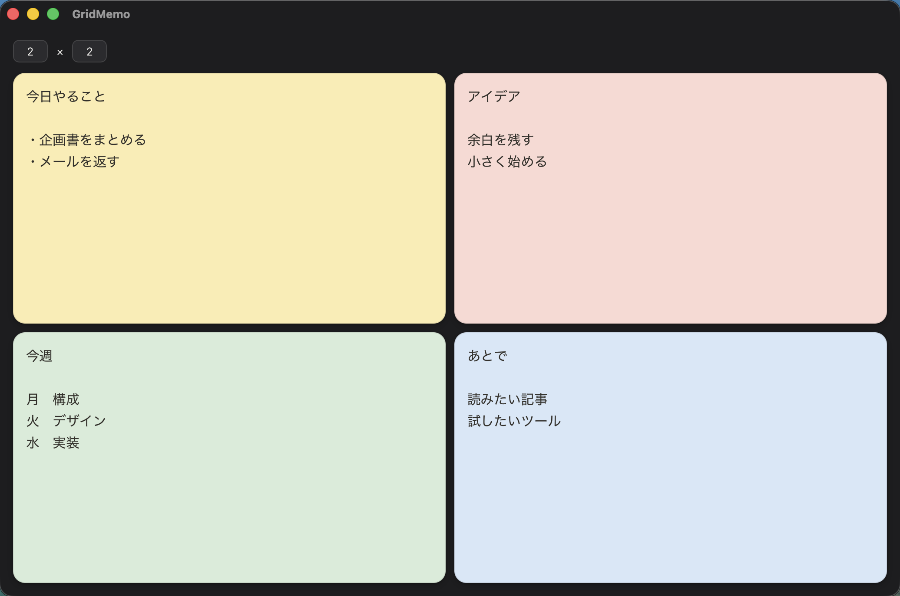
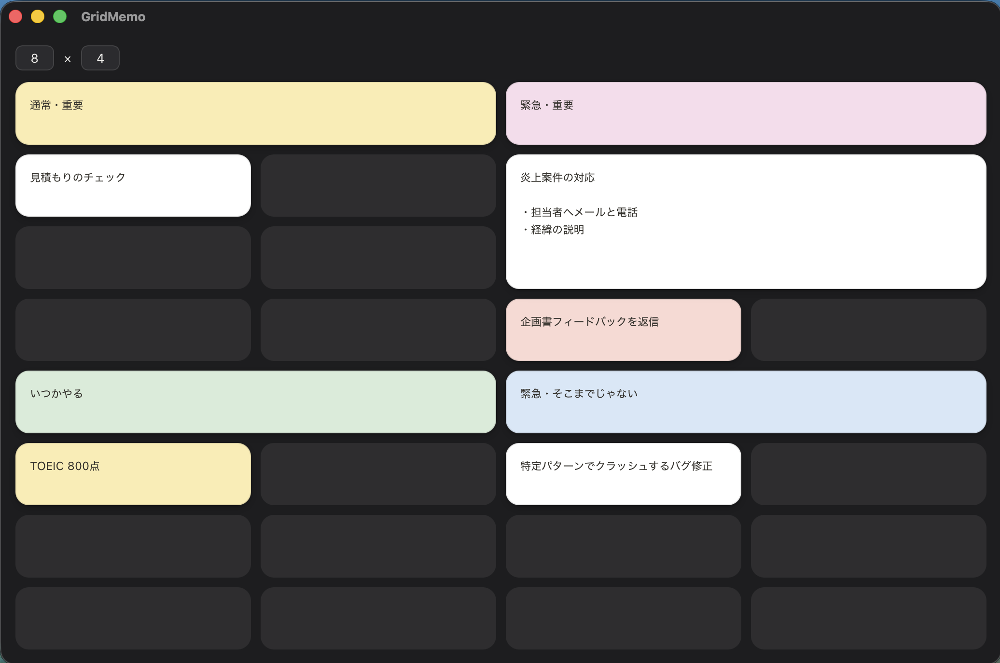
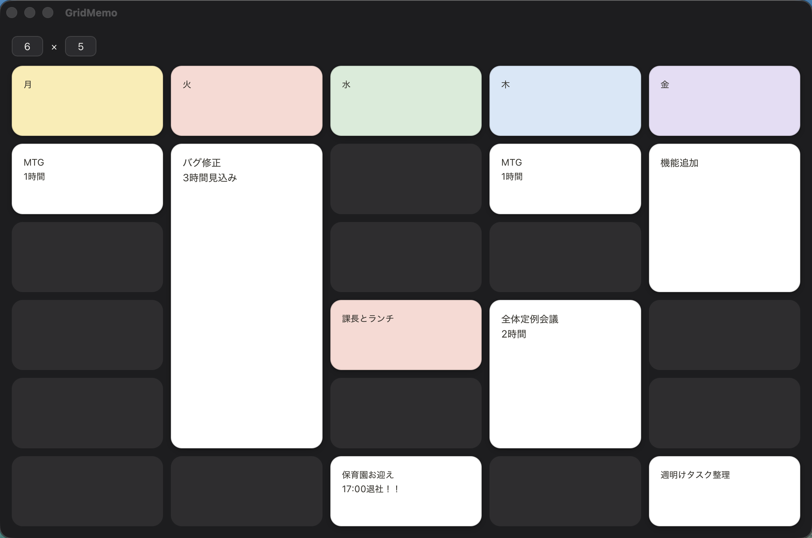

# GridMemo

**1枚のボードで、考えを見渡す。役目が終わったメモは、自然に消える。**

GridMemoは、タスク、アイデア、予定などを自由なグリッドへ並べて、全体をひと目で見渡せるMac用メモアプリです。分類や整理に時間をかけず、必要な場所をクリックしてすぐに書き始められます。

このリポジトリでは無料お試し版を配布しています。新機能の追加は予定しておらず、必要に応じてバグ修正のみを行います。

## ダウンロード

[最新のGridMemoをダウンロード](https://github.com/ta-uryu/grid-memo/releases/latest)

DMGを開き、GridMemoを「アプリケーション」フォルダへ移動してください。macOS 12以降に対応しています。

## できること

- 1×1〜8×8のグリッドで、用途に合うボードを作る
- セルを結合・分割して、情報のまとまりを表現する
- メモをドラッグ＆ドロップで入れ替える
- 1日、1週間、1か月後の自動消去を設定する
- グローバルショートカットですぐに表示する
- 常に手前へ表示して、作業中のメモを見失わない
- ローカルへ自動保存し、次回も同じ状態から再開する

リッチテキスト、画像保存、クラウド同期、複雑な整理機能はありません。書いて、使って、消す。そのための小さな道具です。

## 使い方の例

### 優先度で並べる

重要さや緊急度でセルを結合し、いまやることを一枚に並べます。

### 週間スケジュールにする

上段を曜日の見出しにして、その日のタスクや予定を下へ積み上げます。

## サポート

- [サポート](https://ta-uryu.github.io/grid-memo/support/)
- [プライバシーポリシー](https://ta-uryu.github.io/grid-memo/privacy/)

## ライセンス

Copyright (c) 2026 ta-uryu. All rights reserved.

本リポジトリの内容および配布物は独占的（proprietary）です。利用・複製・改変・再配布は許可していません。詳細は [LICENSE](LICENSE) を参照してください。
